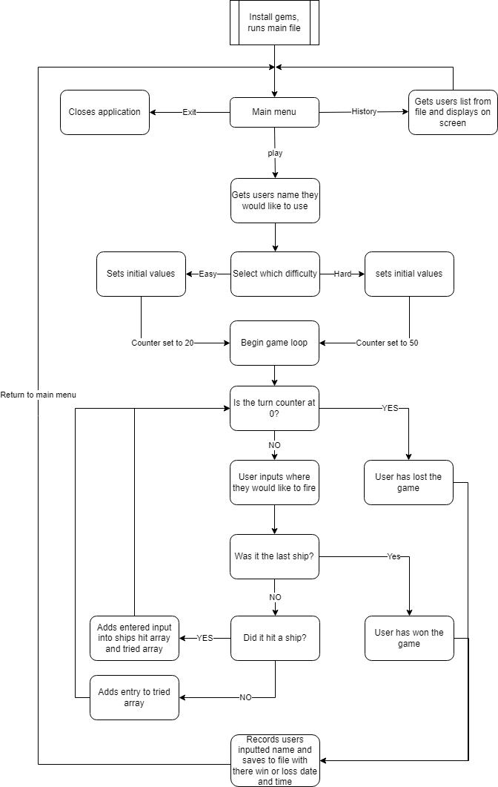
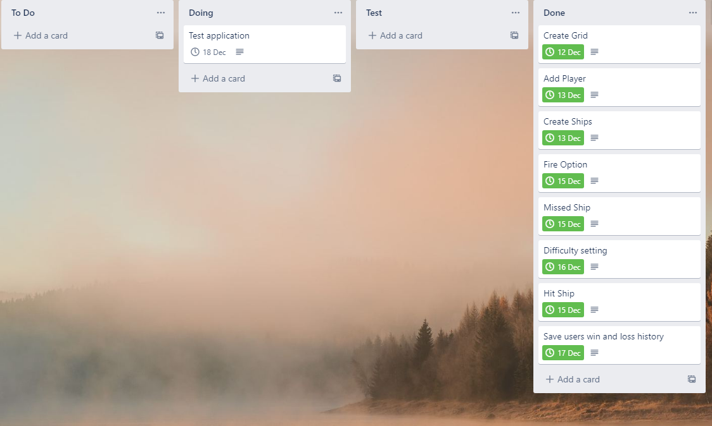

# Battleships

By Donald Heal

# Development Plan

The application will run inside a terminal and keep track of the users ability to beat the game.
It's to be used as a quick and easy way to take a little break from whatever work the user is doing at the time, allowing for a little respite from their main task that they are focusing on while also potentionally supplying a little challange to the user giving them something else to focus or problem solve on for a short while.
This application is targeted at people who spend time working at a computer and need just a quick break inbetween while moving from one task to another or potentialy need a quick destraction while stuck on a problem.
A user can use this application on their computer using their keyboard to navigate around the application. This

# Features

## Menu

This application has an easy to use menu system which allows the user to either play the game, view the match history of completed games and a simple exit function that closes the application.

## History log

The history log allows the user from the menu to view all the entered names from previously completed games and see if they had won or lost trying to sink all the ships. it will also provide the user with the time and date that the game was completed allowing them to keep track of their wins and losses.

## Grid

A displayed grid helps the user know which inputs are accepted and which are not. The grid is nicely displayed on screen for the user.

## Ship markers

The game will display if the user has hit a ship, once the user has successfully hit a ship those particular coordinates will be put into the ship_hit array that the player can see under the grid. This helps the player hunt down the rest of that particular ship and helps them know what is left out there.

## Turn counter

The user plays against a countdown, this countdown can be set when choosing how hard you would like the game to be. Once the counter reaches 0 the user will lose the match and it will be recorded. as a grid is shown with the valid places where the ships can be placed the user can be penalized for not entering a correct location. while location places are not case sensitive if you choose to not use a valid grid location it will drop your turns left by 1. but you will not be penalized for entering a position twice however.

# Application diargam

# Implementation plan

# Install

Run the script from the src file to install relevent gems and run application.
## Dependencies

This application requires the use of ruby and gems gems

- gem colorize 0.8.1

- gem rspec 3.10

- gem tty-prompt 0.23.1

- gem artii  2.1

# Links

Repo link [Battleships](https://github.com/Don-Heal/DonaldHeal_T1A3 "Battleships").
