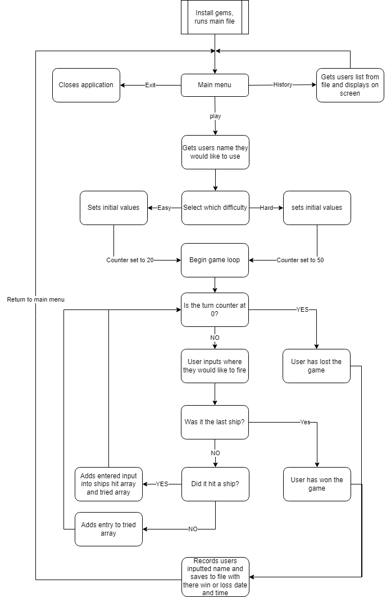

# Battleships

By Donald Heal

# Development Plan

The application will run inside a terminal and keep track of the users ability to beat the game.
It's to be used as a quick and easy way to take a little break from whatever work the user is doing at the time, allowing for a little respite from their main task that they are focusing on while also potentionally supplying a little challange to the user giving them something else to focus or problem solve on for a short while.
This application is targeted at people who spend time working at a computer and need just a quick break inbetween while moving from one task to another or potentialy need a quick destraction while stuck on a problem.
A user can use this application on their computer using their keyboard to navigate around the application.

# Features

## Menu

This application has an easy to use menu system which allows the user to either play the game, view the match history of completed games and a simple exit function that closes the application.

## Multiplayer
you can chose to play against a friend and see who can find the ships the fastest as you race against the timer to try sink all of your ships first.

## History log

The history log allows the user from the menu to view all the entered names from previously completed games and see if they had won or lost trying to sink all the ships. it will also provide the user with the time and date that the game was completed allowing them to keep track of their wins and losses.

## Grid

A displayed grid helps the user know which inputs are accepted and which are not. The grid is nicely displayed on screen for the user.

## Ship markers

The game will display if the user has hit a ship, once the user has successfully hit a ship those particular coordinates will be put into the ship_hit array that the player can see under the grid. This helps the player hunt down the rest of that particular ship and helps them know what is left out there.

## Turn counter

The user plays against a countdown, this countdown can be set when choosing how hard you would like the game to be. Once the counter reaches 0 the user will lose the match and it will be recorded. as a grid is shown with the valid places where the ships can be placed the user can be penalized for not entering a correct location. while location places are not case sensitive if you choose to not use a valid grid location it will drop your turns left by 1. but you will not be penalized for entering a position twice however.

# Application diargam

# Implementation plan
Started by listing the things the game would need to function and divided them up into the steps and order that having them completed would allow to move to the next step. Most of the targets were achived on time with the exeption of a couple which were a bigger problem than expected.

# Installation and Running
To allow the application to run correctly you should run the "install" script from within the terminal and the src folder then use the ./install.sh command this will a use bundeler to install the correct dependencies that are required for the application. It will also start the game for the first time. 
The application is designed to be run from the "main.rb" file from within a terminal and the src folder using the ./Run_game.sh command. The main.rb file has the flags if you wanted to run it manually not using a script they are -help, -info and -install.

## Dependencies

This application requires the use of these ruby and gems

- gem colorize 0.8.1

- gem rspec 3.10

- gem tty-prompt 0.23.1

- gem artii  2.1

This application is a ruby terminal application and will require.
- Bash
- Ruby
- Screen
- Keyboard

# Gameplay
First the user will need to choose if it's a singleplayer or multiplayer game. Once this decision has been made they will need to enter a name for themselves with no limit on characters numbers or symbols. If no name is entered their name will be recorded as nothing. Then you will need to choose a difficulty setting, this will change how many turns you have to find and sink all the ships on the board. If multiplayer was, you will be taken to a menu where you can select who's turn it is, as the turn counter is displayed on screen the other player will notice if you are taking more than 1 turn. There will be a valid grid location displayed on the screen to help you decide where to go. If you were to select something outside the grid it will use a turn counter so make sure you only enter valid grid locations. The input is not case sensitive so upper or lower case will work but you will need to make sure it's a letter then a number not the other way around. if you were to select a grid location that you have selected before you will not lose a turn counter towards this only a message advising that you have entered this before. If a player has found all the ships on the grid they will have the name they entered saved in a file with the time they won. In a multiplayer game it will save the names of who beat who in the match. If the counter reaches 0 the player or players will lose and will be given a game over which will also be recorded. Once the game is complete it will return you to the main menu where you started to either view the history log or choose another game type. Thanks for playing.

# Links

Repo link [Battleships](https://github.com/Don-Heal/DonaldHeal_T1A3 "Battleships").
